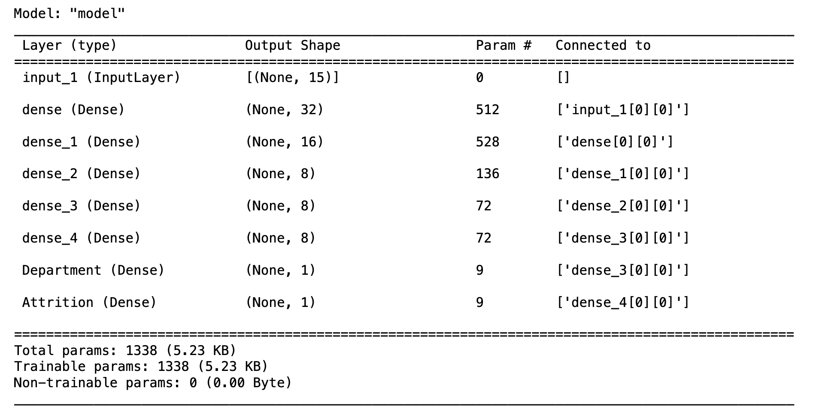
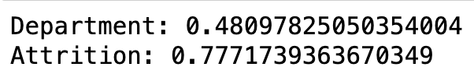

# neural-network-challenge-2
Week 19 Challenge

## Summary

This application analyzes HR data and creates a branched neural network model to predict attrition. The neural network package utilized was Keras with TensorFlow. The model achieved a 77% accuracy score for attrition prediction and 48% accuracy for department prediction.

## Approach

The approach consisted of:

1) Read the csv file to ingest the data and preprocess.
2) Create X and y datasets.
3) Create training and testing datasets.
4) Scale the training data.
5) Create a multi-layer, branched neural network model.
6) Compile and fit the model.
7) Evaluate the model using test data.
8) Answer additional questions.

Model Structure:

Accuracy Scores:

## Plagerism Statement

No specific code was copied but class were referenced for examples and syntax.
